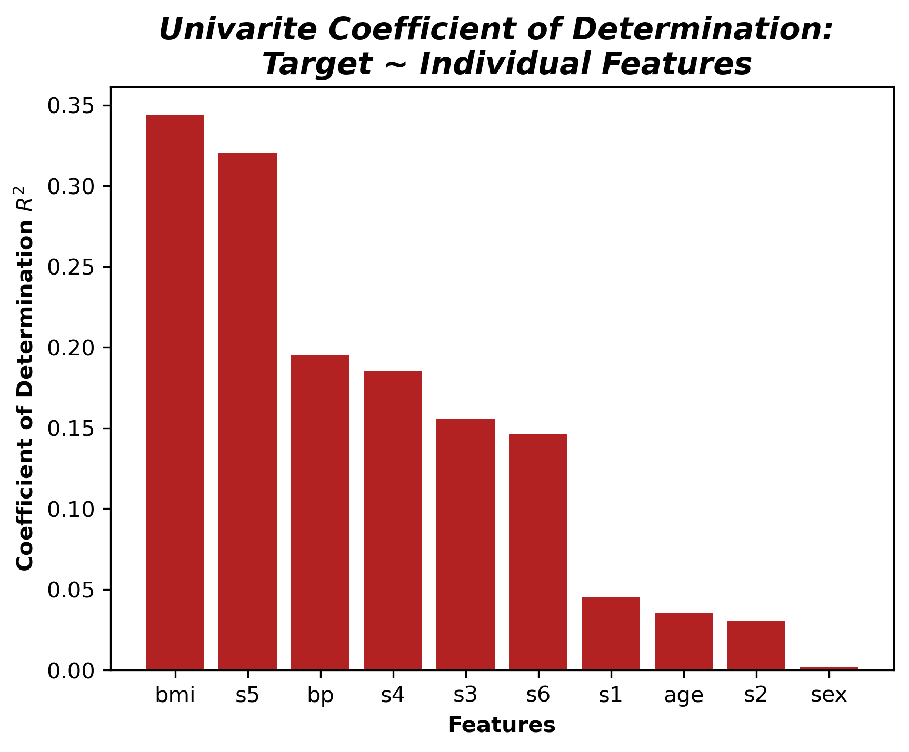
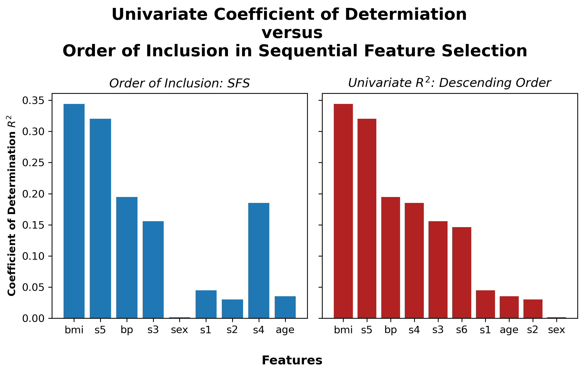
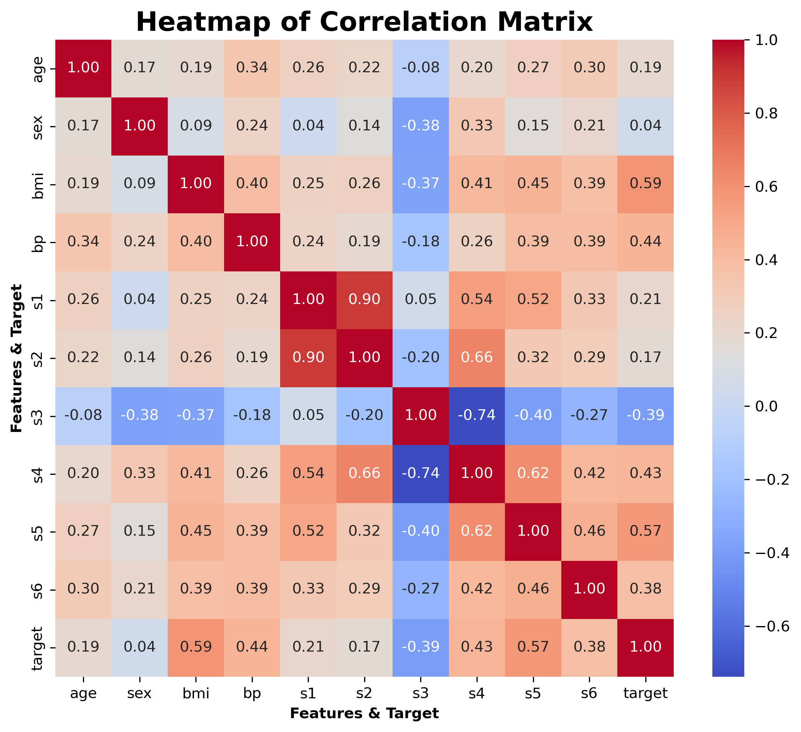
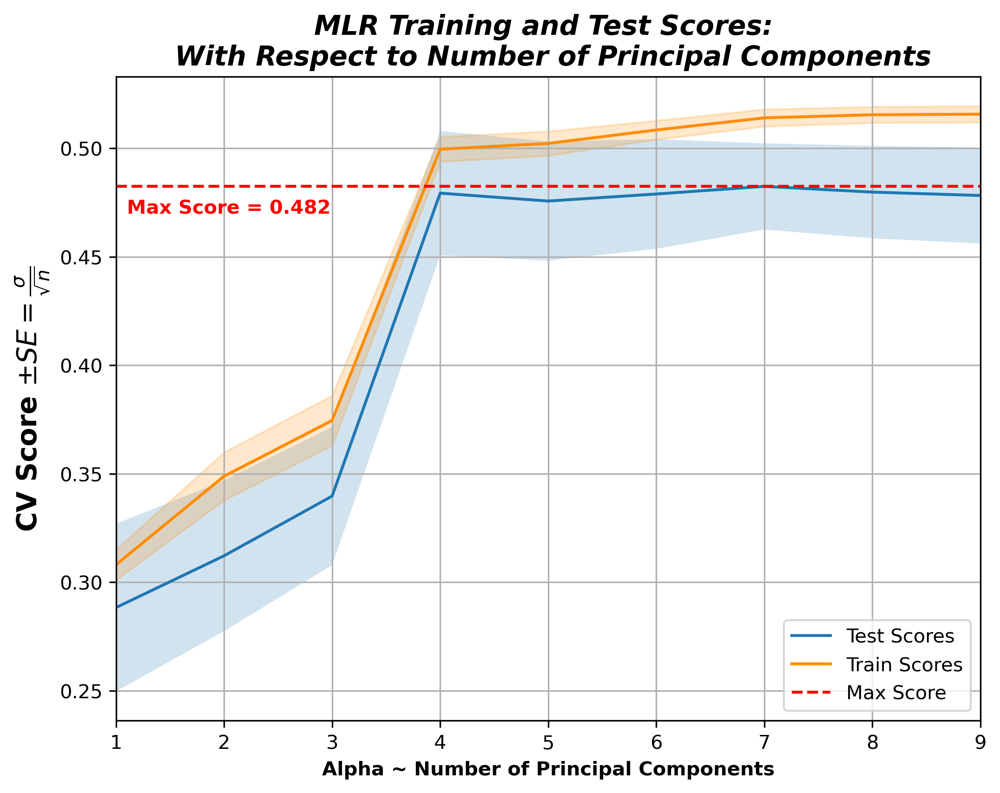
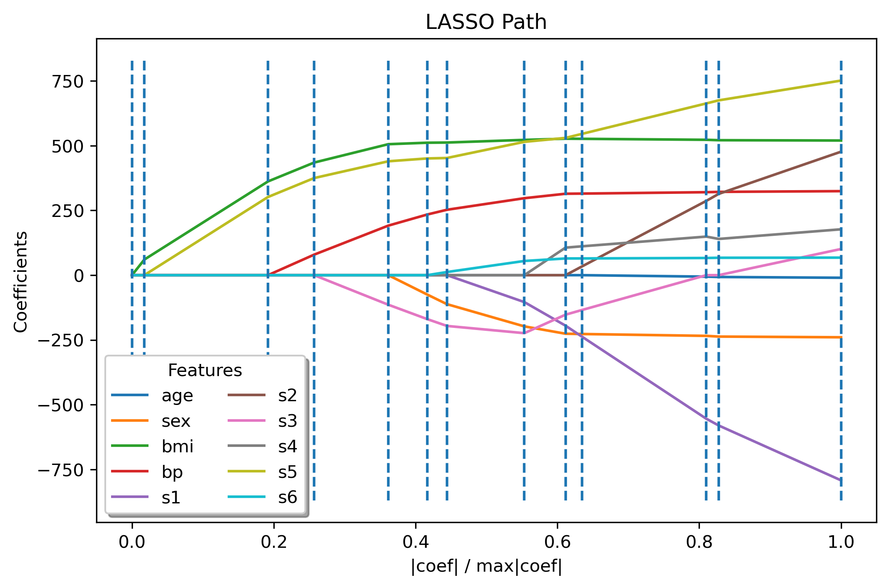

# hw-diabetes

## Goals

* Model-selection techniques using the diabetes dataset
* Comparison of feature ranking with $R^2$, forward selection and Lasso
* PCR (principal component regression) with cross validation to assess feature dimension

## Assignment

Use the diabetes dataset from [sklearn.datasets.load_diabetes](https://scikit-learn.org/stable/modules/generated/sklearn.datasets.load_diabetes.html) to answer the questions below.

### Step 1: Check ```requirements.yml```
If you have all the required packages proceed to step 2, otherwise create a virtual environment with one of the the following commands.

This command will create a conda generated virtual environment
```
make init
```
This command will create a manually generated virtual environment
```
make man_gen_env
```
### Step 2: Create ```figs``` directory
This command will create a ```figs``` folder if it does not already exist.
```
make create_directory
```
___
### Step 3: Question 1

Rank the features according to their squared correlation with the target. 
Note that squared correlation is the same as $R^2$ for univariate regression. 
Visualize the ordered scores with a bar chart.

To reproduce the following figure run this command
```
make q1
```



___

### Step 4: Question 2

Rank the features according to the order that they're added in the [forward sequential feature selection](https://scikit-learn.org/stable/modules/generated/sklearn.feature_selection.SequentialFeatureSelector.html) algorithm. Use this ranking to reorder the bar chart in question 1.

To reproduce the following figure run this command
```
make q2
```


___

### Step 5: Question 3

Compare the bar charts in Questions 1 & 2.
Briefly discuss differences between the two charts and possible causes.
Add a figure to prove your point.

Sequential Feature Selector using a forward selection strategy is a greedy algorithm where the $n$ features selected are the $n$ features that result in the best model, using cross-validation. 

The above graphics demonstrate that $R^2$ in the univariate setting is not additive in the multivariate settting. In other words, the $n$ features with highest univariate $R^2$ will not necessarily result in best $n$ feature multivariate model. As demonstrated.

This phenonmon is the result of relationships among the features, i.e., correlation, or more complex relationships.

In this intance, ```s4``` has the $5^{th}$ highest $R^2$ in the univariate setting but is not included in the multivarite model until after ```s1```, ```s2```, and ```sex```, which all have lower $R^2$ in the univariate setting. One possible explanation is that ```s4``` is correlated with preceeding features. Similarly, ```sex``` faired very poorly in the unvariate setting but was included $5^{th}$ in the multivaritate model. This could be because ```sex``` is not correlated with any of the precedding features.

The following graphic will explore this hypothesis.

To reproduce this graphic run this command
```
make q3
```


As postulated,  ```s4``` has moderate correlation with the preceeding features while ```sex``` has very low correlation.

___

### Step 6: Question 4

Plot cross-validation scores versus the number of components used in Principal Component Regression (PCR). 
(Recall the [PCR vs PLS](https://scikit-learn.org/stable/auto_examples/cross_decomposition/plot_pcr_vs_pls.html)
demo mentioned in class.)
Include both training and test scores.
Comment on the dimensionality of the dataset and the degree of overfitting.
Hint: The [CV-diabetes demo](https://scikit-learn.org/stable/auto_examples/exercises/plot_cv_diabetes.html),
which uses cross-validation to determine the best `alpha`, may be helpful in answering this question.

To reproduce the following graphic run this command.
```
make q4
```


This graphic shows that the PCR model performs the best when the first $4$ principal components are included in the model. Inclusion of additional components may lead to overfitting, evidenced by slightly increasing mean training scores and slightly decreasing mean tests scores.

___

### Step 7: Question 5

The [lasso lars demo](https://scikit-learn.org/stable/auto_examples/linear_model/plot_lasso_lars.html) computes and plots the coefficients with lasso. Add a legend to the plot so that you can relate colors to feature names. Briefly compare the lasso ordering to your answers above.

To reproduce the following graphic run this command.

```
make q4
```


The LASSO and Forward Sequential Feature Selection are exactly the same for the first $5$ features included in the model. After the first $5$ features there begin to be differences, perhaps most notably, ```s6``` is included $6^{th}$ using LASSO and not included at all using SFS (or included last).

___

## Step 8: Clean
This command will remove the virutal environment (if you created one).
```
make clean
```
